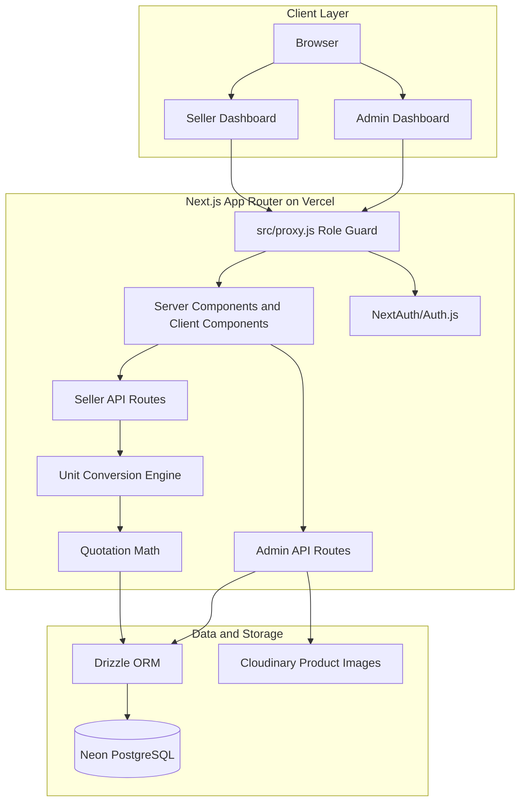
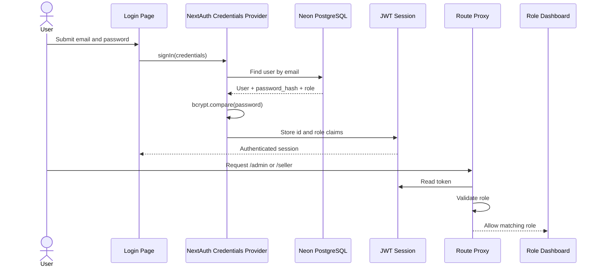
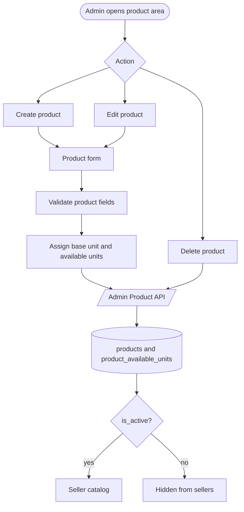
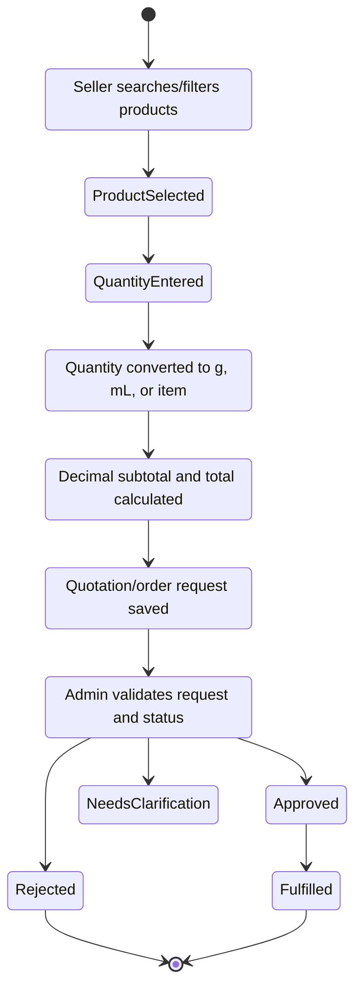
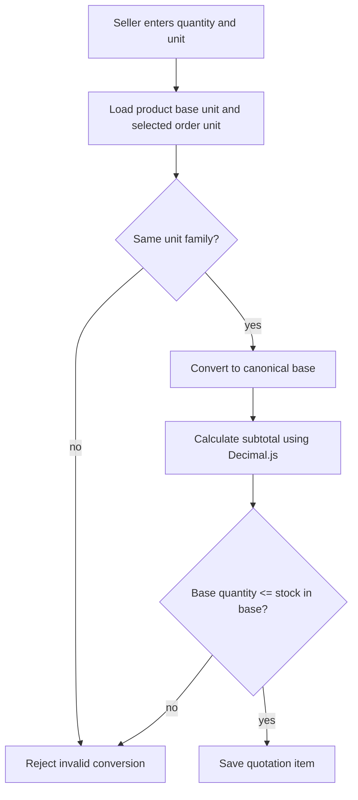
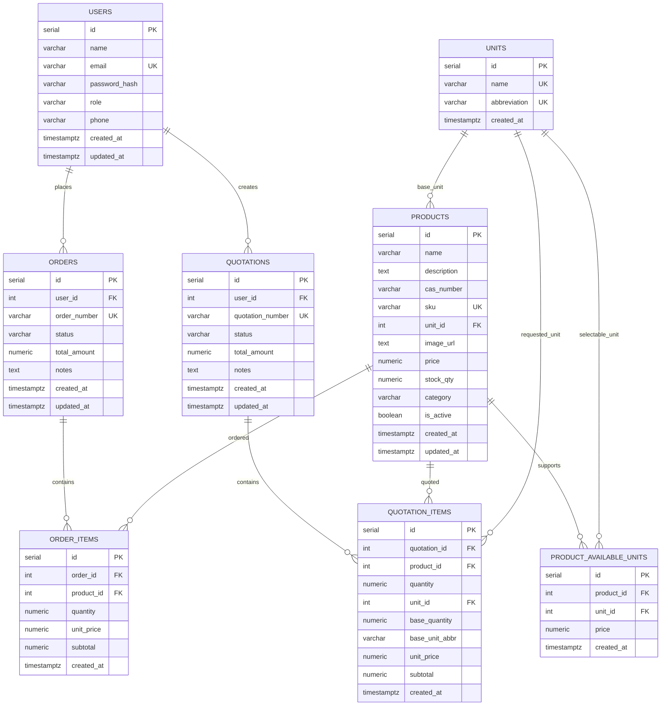
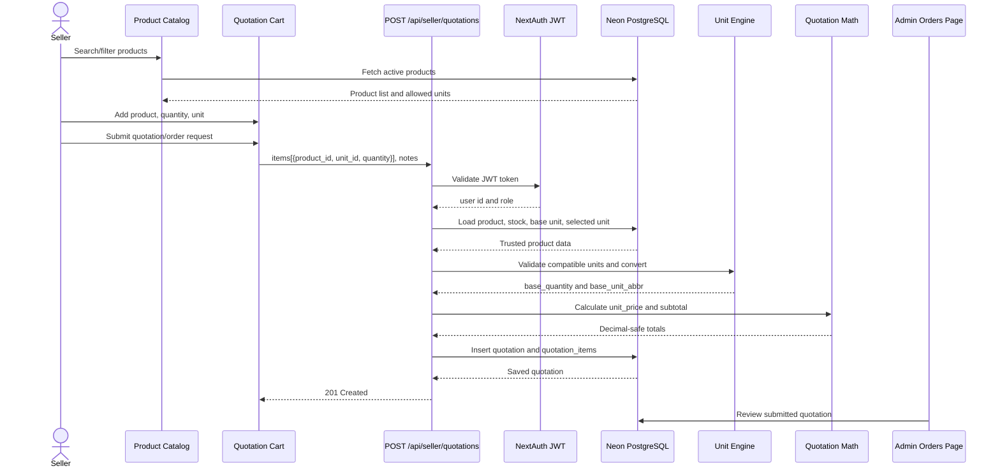
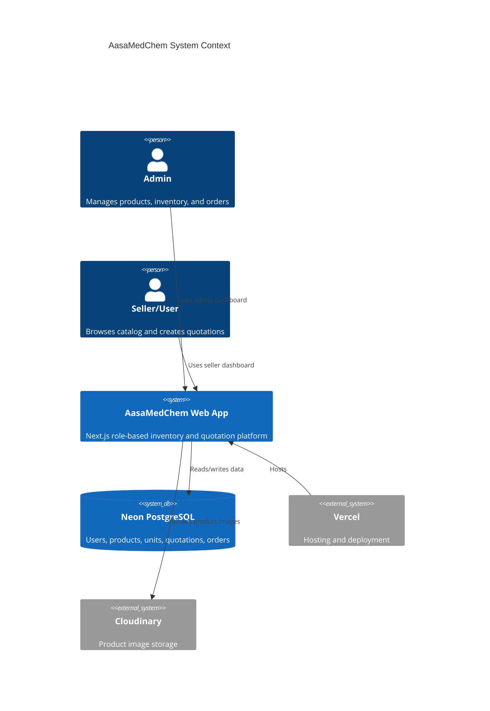

# AasaMedChem Architecture and Diagram Pack

This document contains the high-level architecture, role flows, database ERD, sequence diagrams, folder structure, and diagram definitions for the AasaMedChem hackathon assignment.

## 1. High-Level Architecture Diagram



### Explanation

- Vercel hosts the Next.js application.
- `src/proxy.js` protects admin, seller, profile, and role-specific API routes.
- NextAuth/Auth.js handles credential login and JWT sessions.
- Admin APIs manage inventory, units, uploads, and product records.
- Seller APIs expose active products and create quotations.
- Unit conversion and quotation totals are recalculated on the server before persistence.
- Neon PostgreSQL is the system of record.

## 2. Authentication Flow Diagram



### Role Rules

| Route | Required Role |
| --- | --- |
| `/admin/*` | `admin` |
| `/api/admin/*` | `admin` |
| `/seller/*` | `seller` |
| `/api/seller/*` | `seller` |
| `/profile/*` | authenticated user |

## 3. Product Management Flow Diagram



## 4. Order Lifecycle Flow Diagram



## 5. Unit Conversion Flow Diagram



### Conversion Rules

| Input Unit | Base Unit | Factor |
| --- | --- | ---: |
| `kg` | `g` | `1000` |
| `g` | `g` | `1` |
| `L` | `mL` | `1000` |
| `mL` | `mL` | `1` |
| `item`, `unit`, `pcs` | `unit` | `1` |

Formula:

```text
base_quantity = ordered_quantity * unit_factor
subtotal = base_price * quantity_in_product_base_unit
```

## 6. Database ER Diagram



## 7. Sequence Diagram for Placing Orders



## 8. Folder Structure Diagram

```text
aasamedchem/
├── docs/
│   ├── architecture.md
│   ├── api-endpoints.md
│   ├── assumptions.md
│   ├── database-schema.md
│   ├── excalidraw-diagrams.md
│   ├── implementation-plan.md
│   ├── notion-page.md
│   └── technical-decisions.md
├── public/
│   └── architecture-diagram.svg
├── scripts/
│   ├── db-init.js
│   ├── seed-users.js
│   └── add-image.js
├── src/
│   ├── app/
│   │   ├── admin/
│   │   ├── api/
│   │   ├── login/
│   │   ├── profile/
│   │   ├── register/
│   │   └── seller/
│   ├── components/
│   │   ├── admin/
│   │   └── seller/
│   ├── db/
│   │   ├── index.js
│   │   └── schema.js
│   ├── lib/
│   │   ├── quotationMath.js
│   │   ├── schema.sql
│   │   └── units.js
│   └── proxy.js
├── tests/
│   └── units.test.js
├── README.md
├── package.json
└── next.config.mjs
```

## 9. Professional Architecture Image

The repository includes a static architecture image at:

```text
public/architecture-diagram.svg
public/professional-architecture.svg
```

Use it in slides, Notion, README sections, or hackathon submissions.

## 10. System Context



If your Mermaid renderer does not support C4 syntax, use the high-level architecture flowchart above.
