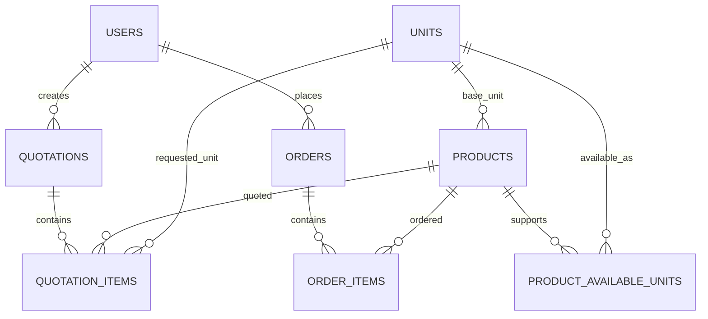

# Database Schema Documentation

Database: Neon PostgreSQL  
ORM: Drizzle ORM  
Bootstrap SQL: `src/lib/schema.sql`  
Drizzle schema: `src/db/schema.js`

## Precision Strategy

The assignment specifies `NUMERIC(20,8)` for prices. The current implementation uses `NUMERIC(30,12)` for prices and quantities to provide more headroom and avoid precision loss in chemical inventory and quotation calculations.

Recommended production standard for the assignment:

```sql
NUMERIC(20,8)
```

Current implementation:

```sql
NUMERIC(30,12)
```

Both satisfy the principle that price and quantity data should not be stored as floating-point numbers.

## Tables

### `users`

Stores authentication, profile, and role information.

| Column | Type | Constraints | Description |
| --- | --- | --- | --- |
| `id` | `SERIAL` | primary key | User id |
| `name` | `VARCHAR(255)` | not null | Display name |
| `email` | `VARCHAR(255)` | unique, not null | Login email |
| `password_hash` | `VARCHAR(255)` | not null | bcrypt password hash |
| `role` | `VARCHAR(50)` | default `user` | `admin` or `seller` |
| `phone` | `VARCHAR(20)` | nullable | Optional profile phone |
| `created_at` | `TIMESTAMPTZ` | default now | Creation timestamp |
| `updated_at` | `TIMESTAMPTZ` | default now | Update timestamp |

Indexes:

- `idx_users_email`

### `units`

Stores supported measurement units.

| Column | Type | Constraints | Description |
| --- | --- | --- | --- |
| `id` | `SERIAL` | primary key | Unit id |
| `name` | `VARCHAR(100)` | unique, not null | Human-readable name |
| `abbreviation` | `VARCHAR(20)` | unique, not null | `kg`, `g`, `L`, `mL`, `unit` |
| `created_at` | `TIMESTAMPTZ` | default now | Creation timestamp |

Seed values:

| Name | Abbreviation | Base Family |
| --- | --- | --- |
| Kilogram | `kg` | weight |
| Gram | `g` | weight |
| Litre | `L` | volume |
| Millilitre | `mL` | volume |
| Unit | `unit` | count |

### `products`

Stores chemical product inventory and pricing data.

| Column | Type | Constraints | Description |
| --- | --- | --- | --- |
| `id` | `SERIAL` | primary key | Product id |
| `name` | `VARCHAR(255)` | not null | Product name |
| `description` | `TEXT` | nullable | Product description |
| `cas_number` | `VARCHAR(50)` | nullable | Chemical CAS number |
| `sku` | `VARCHAR(100)` | unique | Internal SKU |
| `unit_id` | `INTEGER` | FK `units.id` | Base unit |
| `image_url` | `TEXT` | nullable | Product image URL |
| `price` | `NUMERIC(30,12)` | not null, default 0 | Price per base unit |
| `stock_qty` | `NUMERIC(30,12)` | not null, default 0 | Stock in product base unit |
| `category` | `VARCHAR(100)` | nullable | Product category |
| `is_active` | `BOOLEAN` | default true | Seller catalog visibility |
| `created_at` | `TIMESTAMPTZ` | default now | Creation timestamp |
| `updated_at` | `TIMESTAMPTZ` | default now | Update timestamp |

Indexes:

- `idx_products_sku`
- `idx_products_cas`
- `idx_products_category`
- `idx_products_active`

### `product_available_units`

Maps products to units a seller may request.

| Column | Type | Constraints | Description |
| --- | --- | --- | --- |
| `id` | `SERIAL` | primary key | Mapping id |
| `product_id` | `INTEGER` | FK `products.id`, cascade delete | Product |
| `unit_id` | `INTEGER` | FK `units.id`, cascade delete | Allowed order unit |
| `price` | `NUMERIC(30,12)` | default 0 | Optional unit-level price |
| `created_at` | `TIMESTAMPTZ` | default now | Creation timestamp |

Indexes:

- `idx_pau_product`

### `quotations`

Stores seller-submitted quotation/order request headers.

| Column | Type | Constraints | Description |
| --- | --- | --- | --- |
| `id` | `SERIAL` | primary key | Quotation id |
| `user_id` | `INTEGER` | FK `users.id` | Seller/user |
| `quotation_number` | `VARCHAR(50)` | unique, not null | Human-readable quote number |
| `status` | `VARCHAR(50)` | default `draft` | Workflow status |
| `total_amount` | `NUMERIC(30,12)` | not null, default 0 | Server-calculated total |
| `notes` | `TEXT` | nullable | Seller notes |
| `created_at` | `TIMESTAMPTZ` | default now | Creation timestamp |
| `updated_at` | `TIMESTAMPTZ` | default now | Update timestamp |

Indexes:

- `idx_quotations_user`
- `idx_quotations_status`

### `quotation_items`

Stores auditable quotation line items.

| Column | Type | Constraints | Description |
| --- | --- | --- | --- |
| `id` | `SERIAL` | primary key | Line item id |
| `quotation_id` | `INTEGER` | FK `quotations.id`, cascade delete | Parent quotation |
| `product_id` | `INTEGER` | FK `products.id` | Product |
| `quantity` | `NUMERIC(30,12)` | not null | Seller-entered quantity |
| `unit_id` | `INTEGER` | FK `units.id` | Seller-selected unit |
| `base_quantity` | `NUMERIC(30,12)` | not null, default 0 | Converted canonical quantity |
| `base_unit_abbr` | `VARCHAR(20)` | not null | `g`, `mL`, or `unit` |
| `unit_price` | `NUMERIC(30,12)` | not null | Calculated price per requested unit |
| `subtotal` | `NUMERIC(30,12)` | not null | Calculated line subtotal |
| `created_at` | `TIMESTAMPTZ` | default now | Creation timestamp |

Indexes:

- `idx_qi_quotation`
- `idx_qi_product`

### `orders`

Represents finalized order headers. This is available as a schema extension point for converting quotations into final orders.

| Column | Type | Constraints | Description |
| --- | --- | --- | --- |
| `id` | `SERIAL` | primary key | Order id |
| `user_id` | `INTEGER` | FK `users.id` | Buyer/seller |
| `order_number` | `VARCHAR(50)` | unique, not null | Order number |
| `status` | `VARCHAR(50)` | default `pending` | Order status |
| `total_amount` | `NUMERIC(30,12)` | default 0 | Order total |
| `notes` | `TEXT` | nullable | Notes |
| `created_at` | `TIMESTAMPTZ` | default now | Creation timestamp |
| `updated_at` | `TIMESTAMPTZ` | default now | Update timestamp |

### `order_items`

Represents finalized order line items.

| Column | Type | Constraints | Description |
| --- | --- | --- | --- |
| `id` | `SERIAL` | primary key | Order item id |
| `order_id` | `INTEGER` | FK `orders.id`, cascade delete | Parent order |
| `product_id` | `INTEGER` | FK `products.id` | Product |
| `quantity` | `NUMERIC(30,12)` | not null | Ordered quantity |
| `unit_price` | `NUMERIC(30,12)` | not null | Unit price |
| `subtotal` | `NUMERIC(30,12)` | not null | Line subtotal |
| `created_at` | `TIMESTAMPTZ` | default now | Creation timestamp |

## Relationships



## Storage Strategy

| Dimension | Stored Internally As | Example |
| --- | --- | --- |
| Weight | grams | `1 kg = 1000 g` |
| Volume | milliliters | `1 L = 1000 mL` |
| Count | items/units | `5 items = 5 unit` |

## Audit Strategy

Quotation items store both:

- the original seller request, such as `1 kg`;
- the canonical converted quantity, such as `1000 g`.

This makes admin review easier and prevents ambiguity when inventory calculations are added.
