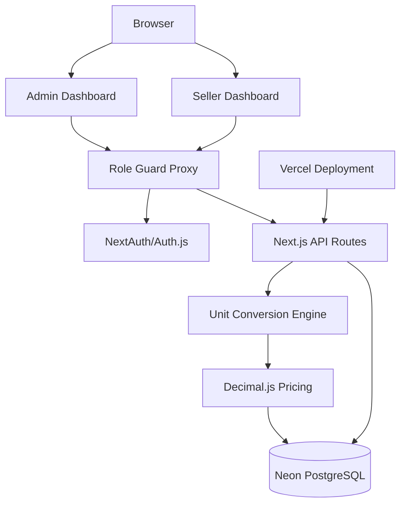
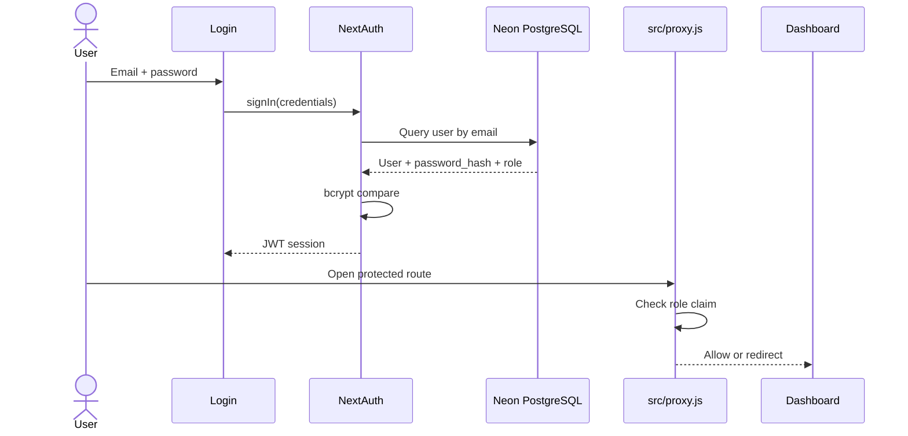
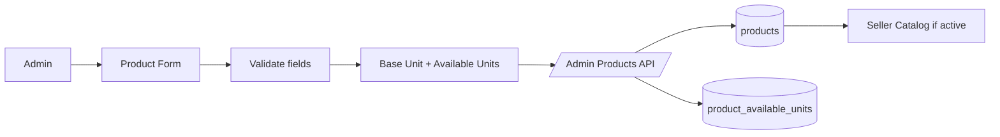
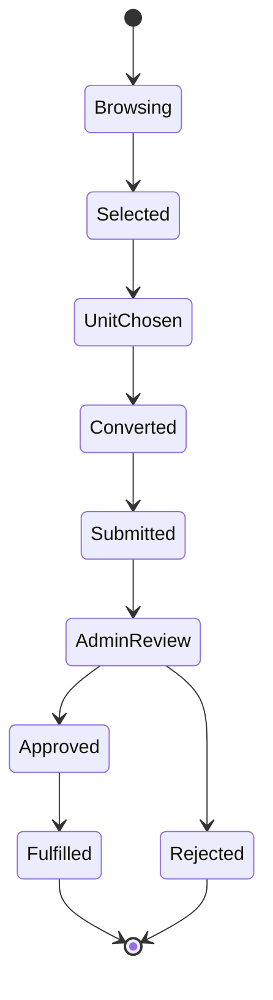
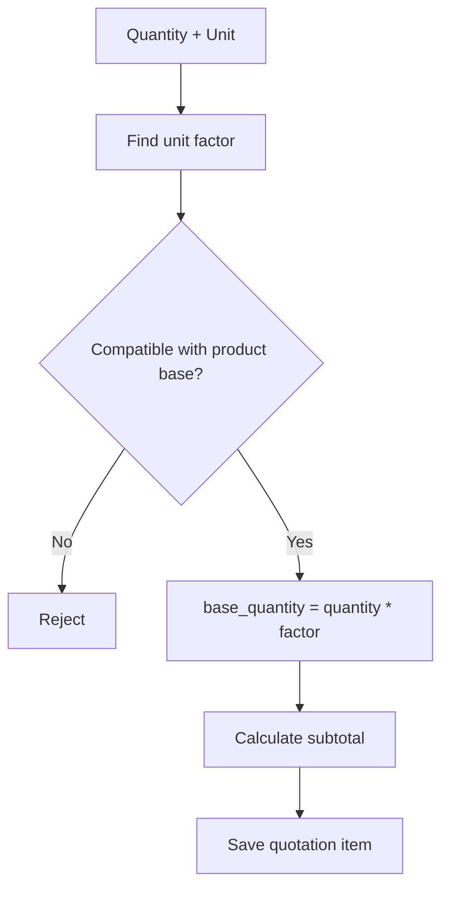
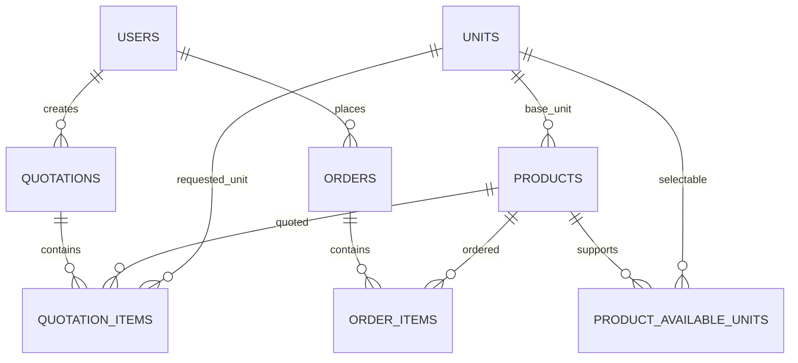

# Excalidraw-ready Diagrams

This document provides Excalidraw-ready scene guidance and importable Mermaid blocks. Excalidraw can import Mermaid diagrams directly through **Insert > Mermaid to Excalidraw** in supported versions.

## Diagram Style Guide

Use a professional software architecture style:

- Background: `#ffffff`
- Primary blue: `#0ea5e9`
- Dark text: `#0f172a`
- Surface: `#f8fafc`
- Border: `#cbd5e1`
- Success green: `#10b981`
- Warning amber: `#f59e0b`
- Error red: `#ef4444`
- Font: clean sans-serif
- Shape style: rounded rectangles for services, cylinders for databases, arrows for flow

## 1. High-Level Architecture

Paste this into Mermaid-to-Excalidraw:



## 2. Authentication Flow



## 3. Product Management Flow



## 4. Order Lifecycle



## 5. Unit Conversion



## 6. Database ERD



## 7. Minimal Excalidraw Scene JSON

Use this as a starter `.excalidraw` file. It creates the main architecture blocks. Excalidraw can then be used to polish colors, icons, and spacing.

```json
{
  "type": "excalidraw",
  "version": 2,
  "source": "https://excalidraw.com",
  "elements": [
    {
      "id": "seller",
      "type": "rectangle",
      "x": 40,
      "y": 100,
      "width": 170,
      "height": 70,
      "angle": 0,
      "strokeColor": "#0ea5e9",
      "backgroundColor": "#f0f9ff",
      "fillStyle": "solid",
      "strokeWidth": 2,
      "strokeStyle": "solid",
      "roughness": 0,
      "opacity": 100,
      "groupIds": [],
      "frameId": null,
      "roundness": { "type": 3 },
      "seed": 1,
      "versionNonce": 1,
      "isDeleted": false,
      "boundElements": [],
      "updated": 1,
      "link": null,
      "locked": false
    },
    {
      "id": "app",
      "type": "rectangle",
      "x": 310,
      "y": 70,
      "width": 240,
      "height": 130,
      "angle": 0,
      "strokeColor": "#334155",
      "backgroundColor": "#f8fafc",
      "fillStyle": "solid",
      "strokeWidth": 2,
      "strokeStyle": "solid",
      "roughness": 0,
      "opacity": 100,
      "groupIds": [],
      "frameId": null,
      "roundness": { "type": 3 },
      "seed": 2,
      "versionNonce": 2,
      "isDeleted": false,
      "boundElements": [],
      "updated": 1,
      "link": null,
      "locked": false
    },
    {
      "id": "db",
      "type": "ellipse",
      "x": 680,
      "y": 85,
      "width": 190,
      "height": 100,
      "angle": 0,
      "strokeColor": "#10b981",
      "backgroundColor": "#ecfdf5",
      "fillStyle": "solid",
      "strokeWidth": 2,
      "strokeStyle": "solid",
      "roughness": 0,
      "opacity": 100,
      "groupIds": [],
      "frameId": null,
      "roundness": null,
      "seed": 3,
      "versionNonce": 3,
      "isDeleted": false,
      "boundElements": [],
      "updated": 1,
      "link": null,
      "locked": false
    },
    {
      "id": "sellerText",
      "type": "text",
      "x": 78,
      "y": 124,
      "width": 90,
      "height": 25,
      "angle": 0,
      "strokeColor": "#0f172a",
      "backgroundColor": "transparent",
      "fillStyle": "solid",
      "strokeWidth": 1,
      "strokeStyle": "solid",
      "roughness": 0,
      "opacity": 100,
      "groupIds": [],
      "frameId": null,
      "roundness": null,
      "seed": 4,
      "versionNonce": 4,
      "isDeleted": false,
      "boundElements": [],
      "updated": 1,
      "link": null,
      "locked": false,
      "text": "Seller/User",
      "fontSize": 20,
      "fontFamily": 1,
      "textAlign": "center",
      "verticalAlign": "top",
      "containerId": null,
      "originalText": "Seller/User",
      "lineHeight": 1.25
    },
    {
      "id": "appText",
      "type": "text",
      "x": 348,
      "y": 105,
      "width": 165,
      "height": 50,
      "angle": 0,
      "strokeColor": "#0f172a",
      "backgroundColor": "transparent",
      "fillStyle": "solid",
      "strokeWidth": 1,
      "strokeStyle": "solid",
      "roughness": 0,
      "opacity": 100,
      "groupIds": [],
      "frameId": null,
      "roundness": null,
      "seed": 5,
      "versionNonce": 5,
      "isDeleted": false,
      "boundElements": [],
      "updated": 1,
      "link": null,
      "locked": false,
      "text": "Next.js App\\nAuth + APIs",
      "fontSize": 20,
      "fontFamily": 1,
      "textAlign": "center",
      "verticalAlign": "top",
      "containerId": null,
      "originalText": "Next.js App\\nAuth + APIs",
      "lineHeight": 1.25
    },
    {
      "id": "dbText",
      "type": "text",
      "x": 716,
      "y": 120,
      "width": 120,
      "height": 25,
      "angle": 0,
      "strokeColor": "#0f172a",
      "backgroundColor": "transparent",
      "fillStyle": "solid",
      "strokeWidth": 1,
      "strokeStyle": "solid",
      "roughness": 0,
      "opacity": 100,
      "groupIds": [],
      "frameId": null,
      "roundness": null,
      "seed": 6,
      "versionNonce": 6,
      "isDeleted": false,
      "boundElements": [],
      "updated": 1,
      "link": null,
      "locked": false,
      "text": "Neon PostgreSQL",
      "fontSize": 20,
      "fontFamily": 1,
      "textAlign": "center",
      "verticalAlign": "top",
      "containerId": null,
      "originalText": "Neon PostgreSQL",
      "lineHeight": 1.25
    }
  ],
  "appState": {
    "gridSize": null,
    "viewBackgroundColor": "#ffffff"
  },
  "files": {}
}
```

## Recommended Excalidraw Export List

Create and export these as PNG/SVG for the final submission:

1. High-level architecture.
2. Authentication flow.
3. Product management flow.
4. Order lifecycle.
5. Unit conversion.
6. Database ERD.
7. Place-order sequence diagram.
