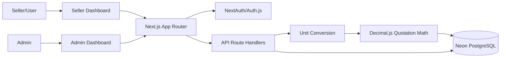

# Notion Documentation Page Content

Copy this page into Notion for a clean hackathon submission.

---

# AasaMedChem - Inventory, Quotation, and Order Platform

## Project Summary

AasaMedChem is a role-based web platform for chemical inventory management and seller quotation workflows. Admins manage chemical products, stock, pricing, and order review. Sellers browse the catalog, search/filter products, choose quantities and units, create quotations, and submit order-ready requests.

The core technical challenge is unit-safe pricing. A product may be stocked in grams but requested in kilograms, or stocked in milliliters but requested in liters. The system converts every seller-entered quantity into a canonical base unit before calculating totals or saving quotation data.

## Problem Statement

Chemical procurement workflows need accurate conversions between commercial units and internal inventory units. Without canonical storage, requests like `1 kg`, `500 g`, `2 L`, and `250 mL` can become ambiguous and error-prone.

AasaMedChem solves this by:

- storing weight internally in grams;
- storing volume internally in milliliters;
- storing count internally as items/units;
- using high-precision `NUMERIC` columns;
- recalculating quotation totals on the server.

## Tech Stack

| Area | Technology |
| --- | --- |
| Framework | Next.js App Router |
| Database | Neon PostgreSQL |
| ORM | Drizzle ORM |
| Authentication | NextAuth/Auth.js |
| Styling | Tailwind CSS and Shadcn UI-ready patterns |
| Deployment | Vercel |
| Precision Math | Decimal.js |

## User Roles

### Admin

Admin users can:

- create products;
- edit products;
- delete products;
- view inventory;
- view submitted orders/quotations;
- update or manage order status as a workflow extension.

### Seller/User

Seller users can:

- browse products;
- search products;
- filter products;
- create quotations;
- place order-ready requests.

## Core Workflow

1. Seller searches products.
2. Seller selects product.
3. Seller enters quantity.
4. Seller chooses unit.
5. System validates unit compatibility.
6. System converts quantity into canonical base unit.
7. System calculates total using trusted database price.
8. Seller places quotation/order request.
9. Admin reviews submitted request.

## Unit Strategy

| Product Dimension | Internal Unit | Examples |
| --- | --- | --- |
| Weight | grams | `1 kg = 1000 g` |
| Volume | milliliters | `1 L = 1000 mL` |
| Count | items/units | `5 items = 5 unit` |

Cross-family conversions are rejected. For example, the system will not convert kilograms into milliliters.

## High-Level Architecture

## Database Overview

Main tables:

- `users`
- `units`
- `products`
- `product_available_units`
- `quotations`
- `quotation_items`
- `orders`
- `order_items`

The most important audit fields are stored in `quotation_items`:

- requested quantity;
- requested unit;
- converted base quantity;
- base unit abbreviation;
- calculated unit price;
- calculated subtotal.

## Authentication and Authorization

Authentication uses the NextAuth Credentials Provider. Passwords are hashed with bcrypt. JWT sessions carry:

- user id;
- role.

Route protection is enforced by `src/proxy.js`.

## API Summary

| Endpoint | Method | Role | Purpose |
| --- | --- | --- | --- |
| `/api/auth/register` | POST | public | Register admin/seller |
| `/api/auth/[...nextauth]` | GET/POST | public | Auth.js handler |
| `/api/health` | GET | public | Health check |
| `/api/admin/products` | GET/POST | admin | List/create products |
| `/api/admin/products/:id` | GET/PUT/DELETE | admin | Product detail/update/delete |
| `/api/admin/units` | GET | admin | List units |
| `/api/admin/upload` | POST | admin | Upload product image |
| `/api/seller/products` | GET | seller | Search/filter active products |
| `/api/seller/quotations` | GET/POST | seller | List/create quotations |

## Key Technical Decisions

- Use canonical unit storage for reliable inventory.
- Use Decimal.js to avoid JavaScript floating-point errors.
- Use PostgreSQL `NUMERIC` for money and quantities.
- Use server-side recalculation to prevent client tampering.
- Use role-based route protection for dashboards and APIs.
- Keep quotations separate from final orders to support admin review.

## Demo Script

1. Login as admin.
2. Create a product with base unit `g`, stock `5000`, and price per gram.
3. Enable `kg` and `g` as seller-selectable units.
4. Login as seller.
5. Search for the product.
6. Add `1 kg` to the quotation cart.
7. Submit quotation.
8. Login as admin.
9. Review the submitted quotation and confirm the converted quantity is `1000 g`.

## Success Criteria

- Admin can manage inventory.
- Seller can search and filter product catalog.
- Seller can create quotations with unit conversion.
- Server validates unit compatibility and stock.
- Admin can review submitted quotation/order requests.
- Database stores audit-safe conversion data.

## Future Improvements

- Convert quotations into confirmed orders.
- Add order status update API.
- Add email notifications.
- Add payment integration.
- Add stock deduction on admin approval.
- Add low-stock alerts.
- Add admin audit logs.
- Add CSV import/export.
